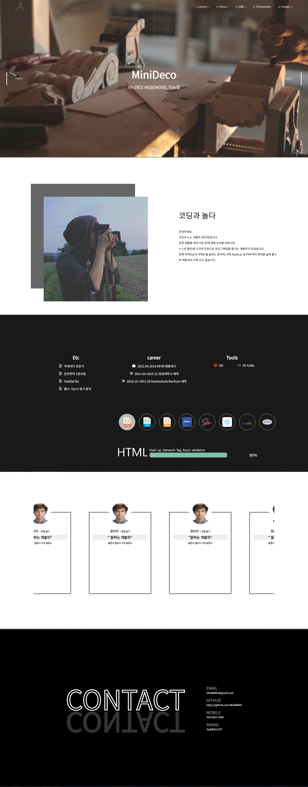

# Portfolio_Project

> 기획 의도

    이번 프로젝트는 저를 소개해보는 페이지 이며
    지금까지 진행했던 프로젝트들을 정리해보는 페이지를 목표로 제작하였습니다. 
    하나하나 정성스레 제작했던 저의 웹페이지를 여러 사람들이 볼 수 있게 
    제작하였습니다.

> 참여도

    개인 프로젝트 100%

>skill

    React Js, Scss, Photoshop, PHP, MySQL

>기능

    Slick, Modal, ScrollIntoView, Axios, etc Hooks

>프로젝트 기간
    2021.09-2021.10

  
> 핵심 기능 설명

    이번 프로젝트에 핵심기능은 Axios 입니다. 
    PHP를 이용하여 관리자 모드를 만들고 포트폴리오의 정보를 입력받아
    데이터베이스에 저장시키고 해당 데이터베이스를 JSON파일로 변환 시킵니다. 
    React 안에서 Axios를 이용하여 JSON파일을 불러와서 Slick과 Testimonial 탭에 
    연결 시켰습니다. Axios를 비동기 처리하여 불러오는 도중 생기는 오류를 하나씩 
    해결해 나가며, Slick과 연결시켜 클라이언트가 원하는 정보만을 띄워주는 모달창을 만들었습니다. 
    그리고 useRef를 이용하여 tab들간에 ScrollIntoView, 애니메이션 효과를 넣었습니다.  

> useAxios

    const getPortfolio = async () => {
    const responsive = await axios.get("/data/work.json",{
        method: 'GET',
        headers: {
            'Access-Control-Allow-Origin': '*',
            'Content-Type': 'application/json',
        }
    })
    return responsive;

    const useAxios = ( sort ) => {
    let [portData, setPortData] = useState();

    useEffect( () => {
        if(sort == "portfolio"){
            getPortfolio().then( res => { setPortData(res.data) });
        }else if(sort == "testimonial"){
            getTestimonial().then( res => { setPortData(res.data) });
        }
        
    }, []);  
    

    return portData;
}

> pages

  

>포트폴리오 사이트 바로가기 [here]("http://dlsdk0601.dothome.co.kr/")